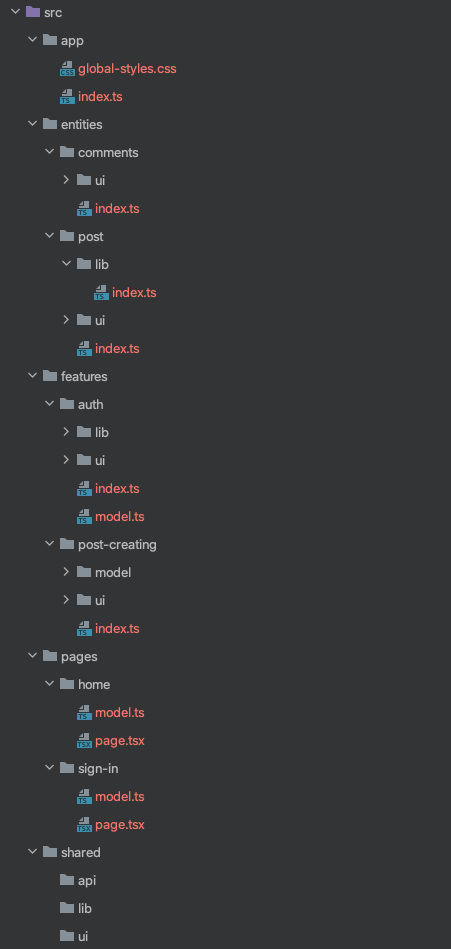

# feature-sliced

<!-- 🏅 Add badges -->

<!--
[npm]: https://www.npmjs.com/package/NPM_PACKAGE

[][npm]
[][npm]
[][npm]

-->

<!-- 🖼️ Add logo / primary image -->

<!-- ⚡ Add primary information & features about your repository -->
Методология, помогающая определять разбиение модулей и связи между ними в приложении

- Обеспечивает [**понятность и явность архитектуры**](https://github.com/feature-sliced/wiki/blob/master/about/architecture.md#explicit-%D0%BF%D0%BE%D0%BD%D1%8F%D1%82%D0%BD%D0%BE%D1%81%D1%82%D1%8C%D1%8F%D0%B2%D0%BD%D0%BE%D1%81%D1%82%D1%8C)
- Обеспечивает [**контроль и изоляцию модулей**](https://github.com/feature-sliced/wiki/blob/master/about/architecture.md#control-%D0%BA%D0%BE%D0%BD%D1%82%D1%80%D0%BE%D0%BB%D1%8C%D0%B8%D0%B7%D0%BE%D0%BB%D0%B8%D1%80%D0%BE%D0%B2%D0%B0%D0%BD%D0%BD%D0%BE%D1%81%D1%82%D1%8C)
- Обеспечивает [**адаптивность под проекты**](https://github.com/feature-sliced/wiki/blob/master/about/architecture.md#adaptivity-%D0%B0%D0%B4%D0%B0%D0%BF%D1%82%D0%B8%D0%B2%D0%BD%D0%BE%D1%81%D1%82%D1%8C%D0%BA%D0%B0%D1%81%D1%82%D0%BE%D0%BC%D0%B8%D0%B7%D0%B8%D1%80%D1%83%D0%B5%D0%BC%D0%BE%D1%81%D1%82%D1%8C)

## Overview
`feature-sliced` - структурная методология для JavaScript фронтенд проектов

Главная идея - разделить логику приложения не по типам, **а по функциональности приложения, т.е. согласно бизнес-ценностям**
> См. также `separation of concerns`

## Оглавление
- [Основные понятия](#glossary)
  - [Уровень приложения](#glossary-app)
  - [Feature](#glossary-feature)
  - [Entity](#glossary-entity)
  - [Page](#glossary-pages)
  - [Shared](#glossary-shared)
  - [Model](#glossary-model)
  - [UI](#glossary-ui)
  - [Api](#glossary-api)
  - [Lib](#glossary-lib)

- [Построение проекта по методологии](#project-building) 
  - [High и Low levels](#project-building-high-and-low)
  - [Файловая структура приложения](#project-building-structure)
  - [Взаимодействие между частями приложения](#project-building-cooperation)
    - [Импорты](#project-building-cooperation-imports)
    - [Публичное Апи](#project-building-cooperation-public-api)

## Основные понятия 

### Уровень приложения 
Код отвечающий за инициализацию приложения. 
Например: 
 - рутовый компонент приложения
 - подключение глобальных стилей
 - настройка роутера
 - для пользователей redux - сбор рутового редьюсера, создание стора.
 - оборачивание всего приложения в необходимые провайдеры

### Feature 
Фича - кусок кода отвечающие за конкретную функциональность приложения. Фича несет ценность конечному пользователю.
Разбиение на фичи происходит с точки зрения пользователя приложения.

Пример фич:
 - аутентификация
 - создание поста
 - изменения настроек аккаунта

### Entity  
Сущность - кусок кода отвечающие за код работающие с конкретной бизнес сущностью.

Пример сущностей:
 - текущий пользователь / сессия 
 - пост
 - комментарий
 - пользователь

### Page  
Страница - компоненты страницы подключаемый в роутере приложения.

### Shared  
Переиспользуемый код приложения, не содержащий в себе бизнес логики.

Примеры: 
- пакет для работы с датами
- ui-kit вашего проекта (кнопки, инпуты, чекбоксы и тп)
- фабрики редьюсеров

### Model  
Модель - Data-слой абстракции для работы со стейтом / событиями.

Примеры:
 - для пользователей редакса модель - набор редьюсеров/экшенов/селекторов для решения конкретной задачи

### UI  
Набор ui компонентов.

### Api 
Api - код для взаимодействия с внешними сервисами(бекендом).

### Lib 
Набор библиотек, не содержащих в себе бизнес правил и скрывающих детали реализации.

## Построение проекта по методологии 

### High и Low levels 
Оперируя таким абстракциями как features, entities, pages, shared, models, ui, lib, api, приложение, построенное по методологии разбивается на два уровня. 

`High level` - состоит из features, entities, pages, shared и уровня приложения.

`Low level` - состоит из ui компонентов, библиотек, API, моделей.

`Low level` абстракции всегда являются составной частью одной из `High level` абстракции.

При этом уровень приложения и shared существуют в одном экземпляре, а features, entities, pages - это список фич/сущностей/страниц в приложении, и каждая фича/сущность/страница строится на своих `Low level` абстракциях.

### Файловая структура приложения  
High level абстракции формируют для нас корень нашей файлов структуры:

Low level абстракции мы можем увидеть, если раскроем все структуру папок.

 

Как можно заметить: 
 - `Low level` абстракции создаются в рамках `High level` абстракции только при необходимости
 - модель может быть представлена как самостоятельным файлом, так и целой папкой, в зависимости от сложности самой модели

### Взаимодействие между частями приложения 

#### Импорты 
В методологии есть строгое правило на счет импоротов.
Если мы расположим абстракции в следующем порядке
 - app 
 - pages
 - features 
 - entities
 - shared

То по методологии любая абстракция может импортировать только ниже стоящие абстракции.

Так в `app` может импортировать что угодно, с любого уровня приложения, а `shared` не имеет права делать импорты из всех остальных уровней
[(подробнее тут)](https://github.com/feature-sliced/wiki/blob/master/concepts/cross-communication.md)

#### Публичное Апи 

Взаимодействие между частями приложения происходит через [публичное апи](https://github.com/feature-sliced/wiki/blob/master/concepts/public-api.md)

